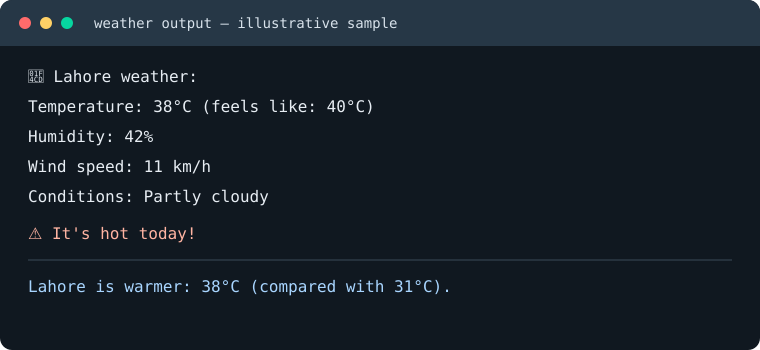

# Live-Weather-Fetcher
A responsive, API-driven live weather fetcher showcasing asynchronous data fetching and modern UI states. Leveraging the OpenWeatherMap API, it retrieves real-time JSON payloads to smoothly render key metrics like UV index, precipitation, and "Feels Like" thermal sensation. Includes robust error handling for invalid locations and offline states.

## Python notebook

This repository also includes a Python notebook for live current weather using
the [wttr.in JSON API](https://wttr.in/) (no API key required). The notebook
fetches a single city or Lahore, Islamabad, Karachi, and Multan; reports
temperature, feels-like temperature, humidity, wind speed, and conditions; and
appends successful all-city results to `weather_log.csv`.

### Run the notebook

Requirements: Python 3.9+, Jupyter Notebook or VS Code, and `requests`.

```bash
python -m pip install requests
```

Open `live-weather-fetcher.ipynb`, run its cells from top to bottom, and enter
a city name when prompted. The all-cities cell appends results to the CSV.
Generated `weather_log.csv` data is excluded from Git.

Temperatures above 35°C print `⚠️ Bohot garmi hai!`. Use
`compare_cities("Lahore", "Karachi")` to compare two cities.

### Sample output

The values are illustrative; live weather changes by location and time.


